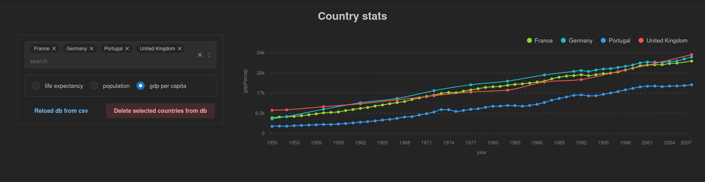

### Project Description

This is an example dash project using docker and a mongo database to store data aswell as dash mantine for the components. It was built up from the [dash minimal example](https://dash.plotly.com/minimal-app) and also uses the [data from the example](https://raw.githubusercontent.com/plotly/datasets/master/gapminder_unfiltered.csv).

It provides a webpage where the user can view the data in the database on a graph, allowing you to select multiple countries and which data you would like to see. It also implements to simple CRUD instructions to either delete selected countries from the live database or reset the database by loading the original data from the csv.

A live version of this project is hosted at https://schonrocks.com/tobias/demo/dash/



As shown on the callback graph below it uses clientside callbacks to track the inputs allowing search queries to be shared between users via the URL and the use of forward and back buttons to browse query history.


### Deployment instructions

For the project only docker and git is required and can be installed for example on a debian system with `sudo apt install docker.io docker-compose-v2 git`

To deploy: 
Clone the repository in your desired directory with `git clone https://github.com/toby-schonrock/dash.git` 

Enter the root directory of the repo.

Create a .env file and set the username and password for the mongodb.
```
MONGO_ROOT_USER=#YOUR_USERNAME
MONGO_ROOT_PASSWORD=#YOUR_PASSWORD
```
Optionally you can set the base path for the app and whether to deploy in development or production mode.
```
APP_ENV=development #default=production
BASE_PATH=/demo/dashapp #default=/
```

Run `sudo docker compose up --build` to start the server and db (`-d` to detach ouput) and your app should be accesible at http://127.0.0.1:8050/{YOUR_BASE_PATH}